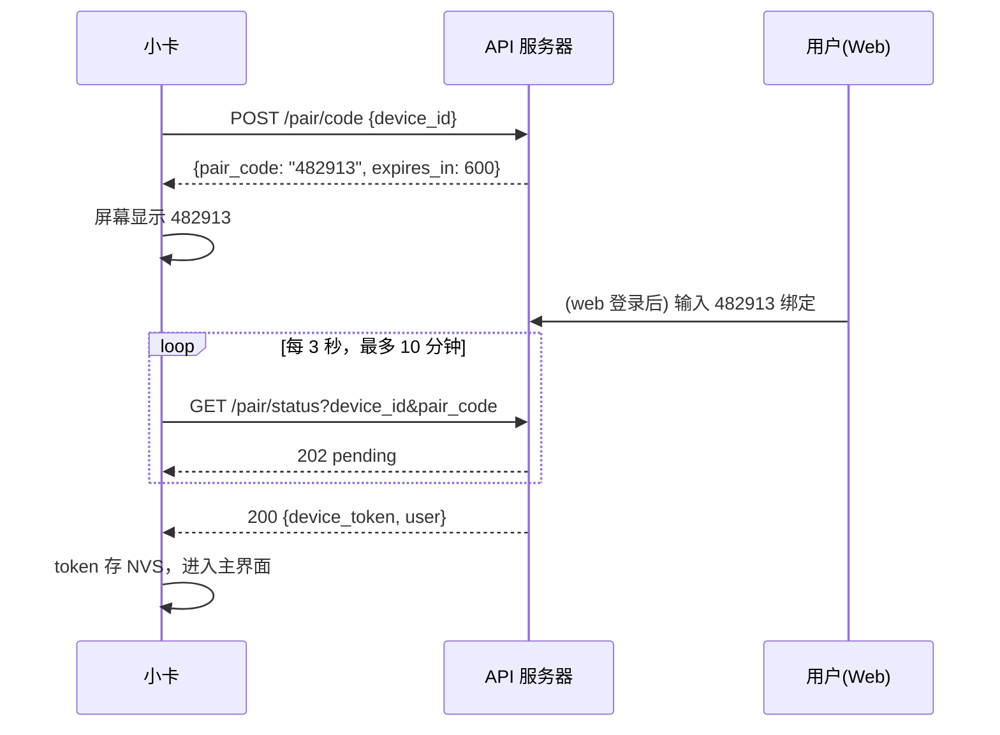
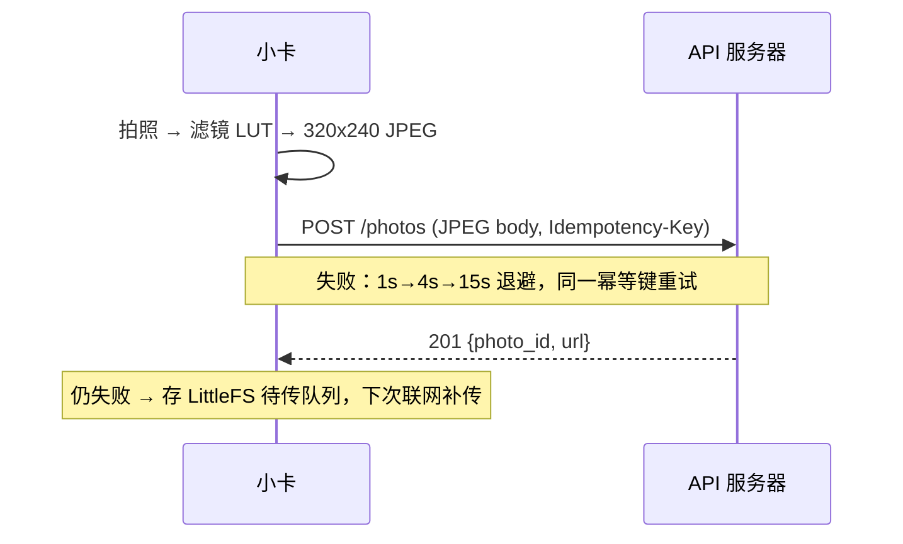

# 小卡 · 设备端 API 规范 v1（硬件工程师交接版）

> **读者**：固件工程师（ESP32-S3 / Arduino 或 ESP-IDF）
> **硬件假设**：ESP32-S3 + 摄像头 + 彩屏 + WiFi，≥ 8MB flash、有 PSRAM
> （M5Stack Unit CAMS3 Lite / CoreS3 SE 均满足；无屏型号需另配显示）
> **本规范是唯一权威**。字段、时序、错误码以此为准；改动必须版本化。

---

## 0. 通用约定

| 项 | 约定 |
|----|------|
| Base URL | `https://api.<域名>/v1` |
| 传输 | 仅 HTTPS（TLS 1.2+）；禁止 HTTP 明文 |
| 认证 | 除配对外，所有请求带 `Authorization: Bearer <device_token>` |
| 数据格式 | JSON（UTF-8）；照片上传/下载为 `image/jpeg` 原始字节流 |
| 时间 | ISO8601 UTC，如 `2026-08-26T09:30:00Z`；设备本地时间用 SNTP 对时，排序以服务器时间为准 |
| 字符编码 | caption 等中文内容 UTF-8；放 HTTP header 时需 URL-encode |
| 版本 | 路径内版本 `/v1`；不兼容改动升 `/v2`，旧版至少保留 6 个月 |

### 错误格式（所有非 2xx 统一）

```json
{ "error": { "code": "PHOTO_TOO_LARGE", "message": "image exceeds 1048576 bytes" } }
```

| HTTP | code | 含义 / 设备行为 |
|------|------|----------------|
| 400 | `BAD_REQUEST` | 参数错；固件视为 bug，记日志不上报用户 |
| 401 | `TOKEN_INVALID` | token 失效（被解绑）→ 清除 NVS token，回到配对流程 |
| 404 | `NOT_FOUND` | 资源不存在 |
| 409 | `ALREADY_EXISTS` | 幂等键已处理过 → **视为成功**，读取返回体即可 |
| 413 | `PHOTO_TOO_LARGE` | 超过 1MB → 固件检查相机 JPEG 参数 |
| 415 | `BAD_CONTENT_TYPE` | 非 JPEG |
| 429 | `RATE_LIMITED` | 响应含 `retry_after`（秒）→ 严格按此退避 |
| 503 | `STORAGE_UNAVAILABLE` | 图片存储暂不可用；照片未发布，稍后按同一幂等键重试 |
| 500 | `SERVER_ERROR` | 指数退避重试（1s → 4s → 15s，至多 3 次） |

---

## 1. 设备配对与绑定

设备无键盘，采用**配对码**模型：设备领码显示 → 用户在 web 输入 → 设备轮询拿到 token。



### 1.1 领取配对码

`POST /pair/code` —— **无需认证**

请求：
```json
{ "device_id": "dvc_a1b2c3d4e5f6", "fw_version": "0.1.0", "hw": "cams3-lite" }
```
- `device_id`：设备唯一 id，出厂烧录或由 MAC 派生（如 `dvc_` + mac hex），**同一设备终身不变**。

响应 `200`：
```json
{ "pair_code": "482913", "expires_in": 600 }
```

### 1.2 轮询配对状态

`GET /pair/status?device_id=dvc_xxx&pair_code=482913` —— **无需认证**

- 未绑定：`202` `{ "status": "pending" }`
- 已绑定：`200`
```json
{
  "status": "bound",
  "device_token": "ak_9f2e...64chars",
  "user": { "username": "ayan", "display_name": "阿岩" }
}
```
- 过期：`410` `{ "error": { "code": "PAIR_EXPIRED" } }` → 重新走 1.1。

> **固件要求**：`device_token` 写入 NVS；此后每次启动读取。收到任一接口 `401 TOKEN_INVALID` 时清除 token 并回到配对流程。

### 1.3 Web 绑定设备

`POST /pair/bind` —— **需要用户登录 token**

Web 用户在设备实验室输入设备屏幕上的配对码后调用：

```json
{ "device_id": "dvc_a1b2c3d4e5f6", "pair_code": "482913" }
```

响应 `200`：

```json
{ "status": "bound", "device_id": "dvc_a1b2c3d4e5f6", "user": { "username": "ayan", "display_name": "阿岩" } }
```

配对码过期或不匹配返回 `410 PAIR_EXPIRED`。绑定成功后，设备继续轮询 `GET /pair/status`，取得写入 NVS 的 `device_token`。

---

## 2. 拍照上传



`POST /photos`

请求头：
| Header | 必填 | 说明 |
|--------|------|------|
| `Authorization` | ✅ | Bearer token |
| `Content-Type` | ✅ | `image/jpeg` |
| `Content-Length` | ✅ | 用定长，**不要 chunked**（嵌入式兼容性） |
| `Idempotency-Key` | ✅ | `"{device_id}-{boot计数}-{照片序号}"`，同一张照片重试必须同键 |
| `X-Filter-Id` | ✅ | 滤镜 id，无滤镜传 `none`（见 §5 滤镜清单） |
| `X-Caption` | 否 | ≤140 字符，URL-encode 后的 UTF-8 |
| `X-Width` / `X-Height` | ✅ | 如 `320` / `240` |

请求体：JPEG 原始字节，**320×240，质量≈12，≤ 100KB**（硬上限 1MB）。

响应 `201`：
```json
{
  "photo_id": "p_01J8XYZ...",
  "url": "https://api.example.com/v1/photos/p_01J8XYZ.../image",
  "created_at": "2026-08-26T09:30:00Z",
  "daily_remaining": 57
}
```

> **幂等语义**：服务器对 `(device_id, Idempotency-Key)` 去重。同键重试返回 `200` + 首次的响应体（不是 201），照片只存一份。断网重传、用户连按，都不会产生重复照片。
> **限额**：60 张/天/设备，超出 `429` + `retry_after`。
> **元数据校验**：`X-Caption` 必须是 URL-encode 的 UTF-8 且不超过 140 字符；`X-Width`/`X-Height` 为 1–8192 的整数；非法值返回 `400 BAD_REQUEST`，不会写入文件。

---

## 3. 拉取好友动态（朋友的照片显示到我的小卡）

### 3.1 设备状态（唤醒后第一个调用）

`GET /device/state`

响应 `200`：
```json
{
  "unseen_count": 3,
  "pending_friend_requests": 1,
  "server_time": "2026-08-26T09:31:02Z",
  "fw_latest": { "version": "0.1.2", "url": "https://.../fw_0.1.2.bin", "md5": "..." }
}
```
- `unseen_count > 0` 才去拉 feed，省电省流量；`= 0` 直接回去睡觉。
- `fw_latest` 为 OTA 预留，MVP 可忽略。

### 3.2 Feed

`GET /feed?limit=8&cursor=<可选>`

请求头建议带 `If-None-Match: <上次的 etag>`；无更新返回 `304`（无 body）。

响应 `200`：
```json
{
  "items": [
    {
      "photo_id": "p_01J8XYZ...",
      "author": { "username": "momo", "display_name": "墨墨" },
      "filter_id": "warm",
      "caption": "今天的云",
      "created_at": "2026-08-26T09:12:40Z",
      "width": 320, "height": 240,
      "image_url": "/v1/photos/p_01J8XYZ.../image",
      "reactions": { "heart": 2, "wow": 1 },
      "my_reactions": []
    }
  ],
  "next_cursor": "eyJjIjoiMjAyNi0...",
  "etag": "W/\"feed-abc123\""
}
```
- feed = **自己 + 已接受好友**的照片，按 `created_at` 倒序（贴贴模式，无广场）。
- `next_cursor` 为 `null` 表示到底。设备端一般只取第一页（最新 8 张）。
- 本地缓存 `etag` 与最近一页，轮询时 304 即无需下载。

### 3.3 下载照片

`GET /photos/{photo_id}/image`（`?size=320` 预留，MVP 只有一档）

- 必须携带有效的 `Authorization: Bearer <device_token>`（Web 端使用用户登录 token）。
- 服务端会再次校验照片是否属于自己或已授权好友；未授权返回 `403 FORBIDDEN`，不依赖客户端隐藏 URL。

- 响应：`200`，`Content-Type: image/jpeg`，`Cache-Control: private, max-age=31536000, immutable`
- 对象存储读取失败返回 `503 STORAGE_UNAVAILABLE`；设备按通用退避策略重试，不把失败响应写入图片缓存。
- 下载到 PSRAM → JPEG 解码 RGB565（推荐 TJpg_Decoder）→ 刷屏。
- 建议在 flash 缓存最近 8 张好友照片（文件名 = photo_id），**离线也能翻看**。

### 3.4 发送/取消反应（按键点赞）

`POST /photos/{photo_id}/reactions`
```json
{ "type": "heart" }
```
`201` 返回最新计数 `{ "reactions": { "heart": 3 } }`。
取消：`DELETE /photos/{photo_id}/reactions/heart` → `204`。
`type` 枚举：`heart | thumbsup | wow`（固件按键映射建议：❤️）。

### 3.5 回执轻信号

`POST /device/ack` —— 需要 `Authorization: Bearer <device_token>`，设备完成动态展示或反应处理后调用，成功返回 `204`。未携带有效 token 返回 `401 TOKEN_INVALID`。

### 3.6 我的历史（可选）

`GET /photos/mine?cursor=` —— 结构同 feed，用于设备翻自己拍过的照片。

---

## 4. 好友与离线预留

| 端点 | 说明 |
|------|------|
| `GET /friends` | `[{username, display_name, since}]`，设备端可用于显示作者名 |
| `POST /friends/claim` | **Phase 2 预留**：`{ticket}` 兑换离线好友票；MVP 返回 `501` |
| `POST /device/heartbeat` | 可选调试：`{battery, rssi, fw_version, free_heap}`，联调期建议每唤醒一次上报 |

好友请求的发起/接受在 **web 端**完成（输入对方 6 位 friend_code），设备端通过 `/device/state` 的 `pending_friend_requests` 感知。

---

## 5. 滤镜清单（设备端实现，服务器只存 id）

滤镜在**设备端**用 LUT/调色实现（ESP32-S3 处理 320×240 无压力），服务器只保存 `filter_id` 元数据。滤镜清单由固件定义并在此登记：

| filter_id | 效果建议 |
|-----------|----------|
| `none` | 原图 |
| `warm` | 色温+暖，贴贴风 |
| `bw` | 黑白高对比 |
| `film` | 胶片颗粒/褪色 |
| `vivid` | 饱和+对比 |

新增滤镜 → 更新本表 + `fw_version` 递增。web 端按 id 显示滤镜名。

---

## 6. 固件实现 Checklist（验收用）

**网络与安全**
- [ ] HTTPS 使用 `esp_crt_bundle_attach`（服务器证书为 Let's Encrypt，根 CA 为 ISRG Root X1，bundle 自带）；**禁止** `skip_cert_verify` 出现在正式固件
- [ ] TLS 握手约需 40KB 堆，确认内存余量；优先复用连接（keep-alive）
- [ ] token / device_id / feed etag / 待传队列 存 NVS 或 LittleFS

**拍照与上传**
- [ ] 相机直出 JPEG 320×240 quality≈12（≤100KB）
- [ ] `Idempotency-Key` 单调递增且重试同键
- [ ] 失败退避 1s→4s→15s；仍失败入待传队列，下次联网补传
- [ ] 收到 401 → 清 token 回配对流程；收到 429 → 按 `retry_after` 休眠

**拉取与显示**
- [ ] 唤醒 → `/device/state` → `unseen_count>0` 才拉 feed
- [ ] JPEG 解码至 RGB565 刷屏；本地缓存最近 8 张好友照片
- [ ] 轮询间隔 ≥ 5 分钟（或按键唤醒），带 `If-None-Match`

**省电（电池设备）**
- [ ] 无操作 60s → light/deep sleep；定时 5–15 分钟唤醒轮询
- [ ] 单次唤醒流程：state → (feed → 下载新图) → sleep，目标 < 20s 在线

**联调**
- [ ] 串口输出每次请求的 `方法 路径 状态码 耗时`
- [ ] 提供"工程模式"：长按某键打印 token 前 8 位 + server_time + unseen_count

---

## 7. 联调方式

1. **Mock 阶段**：后端提供 mock server（同规范，假数据），固件先行开发。
2. **dev 环境**：`https://api-dev.<域名>/v1`，真库真存储，数据每周清空。
3. **验收用例**（M2 里程碑）：
   - 配对 → 上传一张照片 → web 可见
   - 好友设备上传 → 本设备 1 个轮询周期内显示
   - 上传中断网 → 恢复后补传且不重复
   - 解绑 → 设备收到 401 → 自动回配对界面

> 随附 `03-device-api.openapi.yaml`：可导入 Postman/Apifox 直接调试，或生成 mock server。
